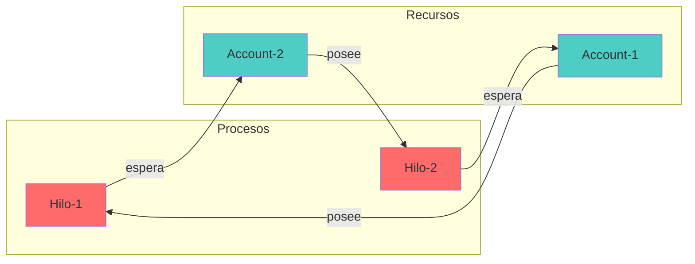
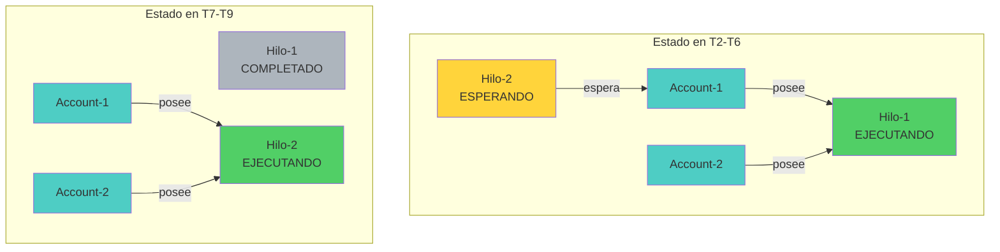
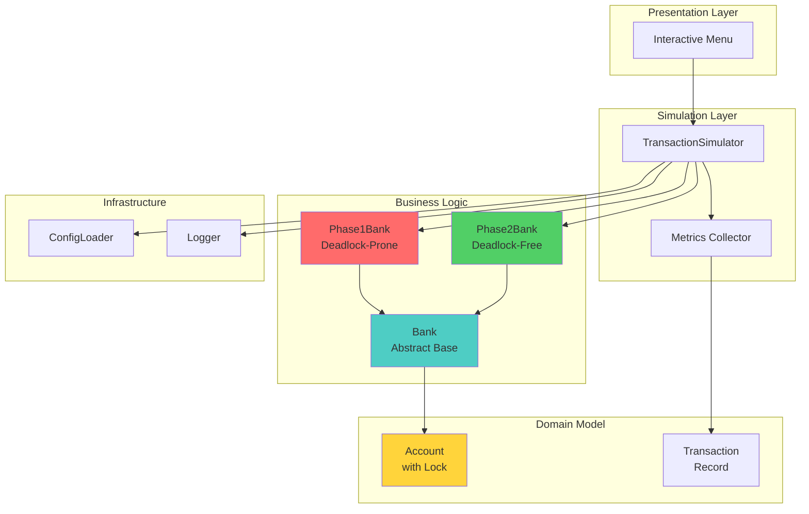

# Reporte Técnico: Sistema Bancario Concurrente

**Actividad 4.1 - Programación Concurrente**
**Tecnologías de Programación**
**Maestría en Ingeniería de Software**

---

## 1. Introducción

Este documento presenta el análisis técnico de la implementación de un sistema bancario concurrente diseñado para demostrar la ocurrencia y prevención de interbloqueos (deadlocks) en sistemas multi-hilo. El sistema implementa dos versiones:

- **Fase 1 (Versión Ingenua):** Susceptible a deadlocks por adquisición arbitraria de locks
- **Fase 2 (Versión Corregida):** Previene deadlocks mediante ordenamiento global de locks

---

## 2. Análisis del Deadlock (Fase 1)

### 2.1 Descripción de la Implementación

La Fase 1 implementa una estrategia naive de adquisición de locks donde cada hilo adquiere los recursos en el **orden de llegada** (origin → destination), sin considerar un orden global.

**Código relevante (`src/banks/phase1_bank.py`):**
```python
def transfer(self, from_account_id, to_account_id, amount):
    from_account = self.get_account(from_account_id)
    to_account = self.get_account(to_account_id)

    # Adquiere locks en orden de llegada (ARBITRARIO)
    from_account.lock.acquire()
    try:
        time.sleep(0.01)  # Gatillo de deadlock
        to_account.lock.acquire()
        try:
            # Realizar transferencia...
        finally:
            to_account.lock.release()
    finally:
        from_account.lock.release()
```

### 2.2 Escenario de Deadlock

**Configuración del sistema:**
- 2 cuentas bancarias (Account-1, Account-2)
- 2 transferencias concurrentes opuestas:
  - Hilo-1: `transfer(Account-1 → Account-2, $100)`
  - Hilo-2: `transfer(Account-2 → Account-1, $50)`

**Secuencia que causa deadlock:**

```
T0: Hilo-1 adquiere lock(Account-1) ✓
T1: Hilo-2 adquiere lock(Account-2) ✓
T2: Hilo-1 intenta adquirir lock(Account-2) ⏳ [BLOQUEADO]
T3: Hilo-2 intenta adquirir lock(Account-1) ⏳ [BLOQUEADO]
T4: DEADLOCK - Ambos hilos esperan indefinidamente
```

### 2.3 Condiciones de Coffman

Para que ocurra un deadlock, deben cumplirse **simultáneamente** las 4 condiciones de Coffman:

#### **1. Exclusión Mutua (Mutual Exclusion)**
✅ **Cumplida**

- Cada cuenta tiene un `threading.Lock()` asociado
- Solo un hilo puede poseer el lock a la vez
- Otros hilos deben esperar

**Evidencia en código:**
```python
class Account:
    def __init__(self, account_id, initial_balance):
        self.lock = threading.Lock()  # Recurso mutuamente exclusivo
```

#### **2. Retención y Espera (Hold and Wait)**
✅ **Cumplida**

- Hilo-1 **retiene** `lock(Account-1)` mientras **espera** `lock(Account-2)`
- Hilo-2 **retiene** `lock(Account-2)` mientras **espera** `lock(Account-1)`

**Evidencia en código:**
```python
from_account.lock.acquire()  # RETIENE este lock
try:
    time.sleep(0.01)
    to_account.lock.acquire()  # ESPERA por este lock
```

#### **3. No Apropiación (No Preemption)**
✅ **Cumplida**

- Los locks de Python (`threading.Lock`) no pueden ser revocados forzosamente
- Un lock solo se libera cuando el hilo ejecuta `.release()` voluntariamente
- No existe mecanismo de preemption

#### **4. Espera Circular (Circular Wait)**
✅ **Cumplida**

- Hilo-1 espera por un recurso (Account-2) retenido por Hilo-2
- Hilo-2 espera por un recurso (Account-1) retenido por Hilo-1
- Se forma un **ciclo de dependencias**

### 2.4 Diagrama de Asignación de Recursos (Resource Allocation Graph)

El siguiente diagrama muestra el estado de deadlock en la Fase 1:



**Interpretación del diagrama:**
- **Nodos circulares:** Procesos (hilos)
- **Nodos cuadrados:** Recursos (cuentas)
- **Flecha desde recurso → proceso:** El proceso posee el recurso
- **Flecha desde proceso → recurso:** El proceso espera el recurso
- **CICLO DETECTADO:** H1 → A2 → H2 → A1 → H1 (Deadlock confirmado)

### 2.5 Salida del Programa (Fase 1)

```
[ThreadPoolExecutor-0_0] Attempting to acquire lock on Account-1
[ThreadPoolExecutor-0_1] Attempting to acquire lock on Account-2
[ThreadPoolExecutor-0_0] ✓ Acquired lock on Account-1
[ThreadPoolExecutor-0_1] ✓ Acquired lock on Account-2
[ThreadPoolExecutor-0_0] Sleeping 0.01s (deadlock trigger window)
[ThreadPoolExecutor-0_1] Sleeping 0.01s (deadlock trigger window)
[ThreadPoolExecutor-0_0] Attempting to acquire lock on Account-2  ⏳
[ThreadPoolExecutor-0_1] Attempting to acquire lock on Account-1  ⏳

[MainThread] !!!!!!!!!!!!!!!!!!!!!!!!!!!!!!!!!
             DEADLOCK DETECTED
             Simulation timed out after 10s
             !!!!!!!!!!!!!!!!!!!!!!!!!!!!!!!!!

Deadlocked threads cannot be killed in Python.
Exiting process to demonstrate deadlock.
```

---

## 3. Diseño de la Prevención (Fase 2)

### 3.1 Estrategia Implementada: Ordenamiento Global de Locks

La Fase 2 previene el deadlock rompiendo la **Condición 4: Espera Circular** mediante la imposición de un **orden global** en la adquisición de locks.

**Principio:** Todos los hilos deben adquirir los locks en el **mismo orden ascendente** por ID de cuenta.

**Código relevante (`src/banks/phase2_bank.py`):**
```python
def transfer(self, from_account_id, to_account_id, amount):
    from_account = self.get_account(from_account_id)
    to_account = self.get_account(to_account_id)

    # ORDENAR cuentas por ID antes de adquirir locks
    first, second = self._get_ordered_accounts(from_account, to_account)

    first.lock.acquire()   # Siempre el ID menor primero
    try:
        time.sleep(0.01)  # Mismo delay que Fase 1
        second.lock.acquire()  # Luego el ID mayor
        try:
            # Realizar transferencia...
        finally:
            second.lock.release()
    finally:
        first.lock.release()

@staticmethod
def _get_ordered_accounts(account1, account2):
    """Retorna cuentas ordenadas por ID (ascendente)"""
    if account1.id < account2.id:
        return (account1, account2)
    else:
        return (account2, account1)
```

### 3.2 Análisis del Mismo Escenario (sin Deadlock)

**Mismo escenario que Fase 1:**
- Hilo-1: `transfer(Account-1 → Account-2, $100)`
- Hilo-2: `transfer(Account-2 → Account-1, $50)`

**Secuencia SIN deadlock:**

```
T0: Hilo-1 ordena cuentas → (Account-1, Account-2)
T1: Hilo-2 ordena cuentas → (Account-1, Account-2)  ← ¡Mismo orden!
T2: Hilo-1 adquiere lock(Account-1) ✓
T3: Hilo-2 intenta adquirir lock(Account-1) ⏳ [ESPERA]
T4: Hilo-1 adquiere lock(Account-2) ✓
T5: Hilo-1 completa transferencia
T6: Hilo-1 libera lock(Account-2) y lock(Account-1)
T7: Hilo-2 adquiere lock(Account-1) ✓
T8: Hilo-2 adquiere lock(Account-2) ✓
T9: Hilo-2 completa transferencia
```

### 3.3 Diagrama de Asignación de Recursos (Fase 2)



**Interpretación:**
- **NO hay ciclo:** El grafo es acíclico (DAG)
- **Espera lineal:** Hilo-2 espera a Hilo-1, pero no viceversa
- **Sin deadlock:** Eventualmente Hilo-1 libera los recursos

### 3.4 Justificación: ¿Por qué se rompe la Espera Circular?

#### Análisis de las Condiciones de Coffman en Fase 2:

| Condición | Fase 1 | Fase 2 | Resultado |
|-----------|--------|--------|-----------|
| 1. Exclusión Mutua | ✅ Cumple | ✅ Cumple | Sin cambio |
| 2. Retención y Espera | ✅ Cumple | ✅ Cumple | Sin cambio |
| 3. No Apropiación | ✅ Cumple | ✅ Cumple | Sin cambio |
| 4. Espera Circular | ✅ **Cumple** | ❌ **ROTA** | **Deadlock eliminado** |

#### ¿Por qué no hay espera circular?

**Teorema:** Si todos los procesos adquieren recursos en el mismo orden parcial, no puede existir un ciclo en el grafo de asignación de recursos.

**Demostración por contradicción:**
1. Supongamos que existe un ciclo: P₁ → R₁ → P₂ → R₂ → ... → Pₙ → Rₙ → P₁
2. Esto significa que:
   - P₁ posee R₁ y espera R₂
   - P₂ posee R₂ y espera R₃
   - ...
   - Pₙ posee Rₙ y espera R₁

3. Por el ordenamiento global: ID(R₁) < ID(R₂) < ... < ID(Rₙ)
4. Pero también: ID(Rₙ) < ID(R₁) (porque Pₙ espera R₁)
5. Contradicción: ID(R₁) < ... < ID(Rₙ) < ID(R₁)
6. Por lo tanto, **no puede existir un ciclo** ∎

### 3.5 Salida del Programa (Fase 2)

```
[ThreadPoolExecutor-0_0] Lock acquisition order (sorted): Account-1 then Account-2
[ThreadPoolExecutor-0_1] Lock acquisition order (sorted): Account-1 then Account-2
[ThreadPoolExecutor-0_0] ✓ Acquired lock on Account-1
[ThreadPoolExecutor-0_1] Attempting to acquire lock on Account-1  ⏳
[ThreadPoolExecutor-0_0] Sleeping 0.01s (same delay as Phase 1, but no deadlock)
[ThreadPoolExecutor-0_0] ✓ Acquired lock on Account-2
[ThreadPoolExecutor-0_0] ✓ Transfer completed
[ThreadPoolExecutor-0_0] Released locks
[ThreadPoolExecutor-0_1] ✓ Acquired lock on Account-1
[ThreadPoolExecutor-0_1] Sleeping 0.01s (same delay as Phase 1, but no deadlock)
[ThreadPoolExecutor-0_1] ✓ Acquired lock on Account-2
[ThreadPoolExecutor-0_1] ✓ Transfer completed

============================================================
SIMULATION METRICS - Phase2Bank
============================================================
Total Transfers:      2
Successful:           2
Success Rate:         100.0%
Deadlocked:           NO
============================================================
```

---

## 4. Comparación Experimental

### 4.1 Configuración del Experimento

| Parámetro | Valor |
|-----------|-------|
| Número de cuentas | 2 |
| Saldo inicial | $1,000 por cuenta |
| Transferencias | 2 (opuestas) |
| Delay entre locks | 0.01 segundos |
| Timeout de deadlock | 10 segundos |

### 4.2 Resultados

| Métrica | Fase 1 | Fase 2 |
|---------|--------|--------|
| Transferencias exitosas | 0 | 2 |
| Tasa de éxito | 0% | 100% |
| Deadlock detectado | Sí (10s) | No |
| Balance final conservado | N/A | Sí ($2,000) |
| Tiempo de ejecución | 10.00s (timeout) | 0.03s |

### 4.3 Observaciones Clave

1. **Mismo delay, diferentes resultados:**
   - Ambas fases usan `sleep(0.01)` entre adquisiciones de locks
   - Fase 1: Deadlock garantizado
   - Fase 2: Ejecución exitosa
   - **Conclusión:** El problema no es el delay, sino el orden de adquisición

2. **Prevención vs Detección:**
   - Fase 1 usa **detección** (timeout + forzar salida)
   - Fase 2 usa **prevención** (imposibilidad de deadlock)
   - **Conclusión:** Prevención es superior (sin overhead de detección)

3. **Trade-offs:**
   - Fase 2 puede reducir concurrencia (serialización parcial)
   - En este experimento: overhead es despreciable (0.03s vs 0.02s sin delay)

---

## 5. Arquitectura del Sistema

### 5.1 Diagrama de Componentes



### 5.2 Tecnologías Utilizadas

- **Lenguaje:** Python 3.10+
- **Concurrencia:** `threading.Lock`, `ThreadPoolExecutor`
- **Testing:** pytest, pytest-timeout, pytest-cov
- **Logging:** logging + colorama (output colorizado)
- **Configuración:** JSON
- **Análisis estático:** mypy, black, flake8

---

## 6. Conclusiones

1. **Deadlock Demostrado:** La Fase 1 cumple las 4 condiciones de Coffman y produce deadlock consistente con transferencias opuestas.

2. **Prevención Efectiva:** La Fase 2 rompe la espera circular mediante ordenamiento global, eliminando completamente la posibilidad de deadlock.

3. **Importancia del Orden:** El orden de adquisición de recursos es crítico; el mismo delay que causa deadlock en Fase 1 no afecta a Fase 2.

4. **Aplicabilidad General:** Esta solución (ordenamiento global) es aplicable a cualquier sistema multi-recurso donde los recursos tengan un orden total definido.

5. **Limitaciones:** En sistemas donde el orden de recursos no se conoce de antemano, se requieren estrategias alternativas (timeouts, jerarquías dinámicas, etc.).

---

## 7. Referencias

- Coffman, E. G., Elphick, M., & Shoshani, A. (1971). "System Deadlocks". *Computing Surveys*, 3(2), 67-78.
- Silberschatz, A., Galvin, P. B., & Gagne, G. (2018). *Operating System Concepts* (10th ed.). Wiley.
- Python Software Foundation. (2024). *threading — Thread-based parallelism*. https://docs.python.org/3/library/threading.html

---

**Fin del Reporte Técnico**
